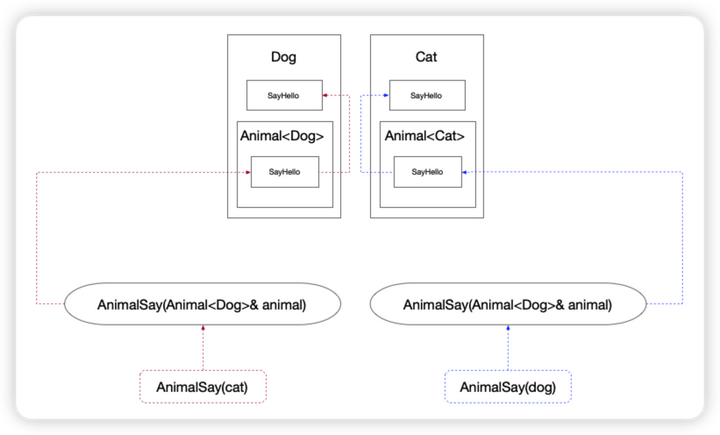

<!--
 * @Author: yao.xie 1595341200@qq.com
 * @Date: 2023-09-12 17:51:54
 * @LastEditors: error: error: git config user.name & please set dead value or install git && error: git config user.email & please set dead value or install git & please set dead value or install git
 * @LastEditTime: 2023-11-13 10:24:19
 * @FilePath: /cplusplus/README.md
 * @Description: 这是默认设置,请设置`customMade`, 打开koroFileHeader查看配置 进行设置: https://github.com/OBKoro1/koro1FileHeader/wiki/%E9%85%8D%E7%BD%AE
-->
- [1. cplusplus](#1-cplusplus)
  - [1.1. 设置DEBUG与release前缀](#11-设置debug与release前缀)
  - [1.2. gtest](#12-gtest)
    - [1.2.1. 安装](#121-安装)
  - [1.3. glog](#13-glog)
    - [1.3.1. 构建](#131-构建)
    - [1.3.2. 使用](#132-使用)
    - [1.3.3. DLOG 只在Debug模式下生效](#133-dlog-只在debug模式下生效)
  - [1.4. eigen](#14-eigen)
    - [1.4.1. 模块与头文件](#141-模块与头文件)
  - [1.5. vector](#15-vector)
  - [1.6. ref](#16-ref)
  - [1.7. opencv](#17-opencv)
    - [1.7.1. ImageWatch](#171-imagewatch)
  - [1.8. benchmark](#18-benchmark)
    - [1.8.1. 安装](#181-安装)
    - [1.8.2. 使用](#182-使用)
  - [1.9. spdlog](#19-spdlog)
  - [1.10. pcapplusplus](#110-pcapplusplus)
    - [1.10.1. 使用](#1101-使用)
  - [1.11. 终端代理](#111-终端代理)
  - [1.12. tinyxml2](#112-tinyxml2)
    - [1.12.1. 使用](#1121-使用)
  - [1.13. QT5](#113-qt5)
  - [1.14. cmake 区分平台](#114-cmake-区分平台)
  - [1.15. C++区分平台](#115-c区分平台)
  - [1.16. cmake版本升级](#116-cmake版本升级)
  - [1.17. cmake 添加库路径](#117-cmake-添加库路径)
  - [1.18. pythontutor](#118-pythontutor)
  - [1.19. backward-cpp](#119-backward-cpp)
  - [1.20. boost](#120-boost)
    - [1.20.1. boost tcp](#1201-boost-tcp)
    - [1.20.2. boost udp](#1202-boost-udp)
  - [1.21. abseil](#121-abseil)
  - [1.22. nlohmann-json](#122-nlohmann-json)
    - [1.22.1. accept 检查json是否合法](#1221-accept-检查json是否合法)
  - [1.23. find\_package.](#123-find_package)
  - [1.24. linux多线程gdb](#124-linux多线程gdb)
  - [1.25. 配置ssh免密](#125-配置ssh免密)
  - [1.26. for\_each 并行](#126-for_each-并行)
  - [1.27. tbb](#127-tbb)
  - [1.28. vcpkg cmake 配置](#128-vcpkg-cmake-配置)
  - [1.29. std::packaged\_task](#129-stdpackaged_task)
  - [1.30. std::shared\_future](#130-stdshared_future)
  - [1.31. notify\_all](#131-notify_all)
  - [1.32. libevent](#132-libevent)
  - [1.33. PIMPL](#133-pimpl)
  - [1.34. CRTP从原理到应用](#134-crtp从原理到应用)
  - [1.35. 智能指针](#135-智能指针)
    - [1.35.1. 三种内存布局](#1351-三种内存布局)
    - [1.35.2. 线程安全 ?](#1352-线程安全-)
    - [1.35.3. 循环引用由来，善用 ？](#1353-循环引用由来善用-)
    - [1.35.4. 探究 enable\_shared\_from\_this 原理](#1354-探究-enable_shared_from_this-原理)
    - [1.35.5. unique\_ptr](#1355-unique_ptr)
  - [1.36. C++之单例的几种写法](#136-c之单例的几种写法)
    - [1.36.1. 单例的几种模式](#1361-单例的几种模式)
  - [1.37. C++ 八股文 --- C/C++内存有哪几种类型](#137-c-八股文-----cc内存有哪几种类型)
    - [1.37.1. 内存分区](#1371-内存分区)
    - [1.37.2. C/C++ 中内存分区总结](#1372-cc-中内存分区总结)
      - [1.37.2.1. 背景](#13721-背景)
      - [1.37.2.2. 常量数据区](#13722-常量数据区)
      - [1.37.2.3. 全局/静态数据区](#13723-全局静态数据区)
      - [1.37.2.4. 栈区](#13724-栈区)
      - [1.37.2.5. 自由存储](#13725-自由存储)
      - [1.37.2.6. 堆区](#13726-堆区)
      - [1.37.2.7. 代码示例](#13727-代码示例)
  - [1.38. placement\_new](#138-placement_new)
  - [1.39. 再也不被时间束缚：C++ std::chrono时间库全面解析](#139-再也不被时间束缚c-stdchrono时间库全面解析)
    - [1.39.1. 基本组成部分：duration、time\_point和clock](#1391-基本组成部分durationtime_point和clock)
    - [1.39.2. duration的使用详解](#1392-duration的使用详解)

# 1. cplusplus
## 1.1. 设置DEBUG与release前缀
```cmake
set_target_properties(${PROJECT_N} PROPERTIES
    DEBUG_POSTFIX "_debug"
    RELEASE_POSTFIX "_release"
)
```
构建debug
```sh
cmake .. -DCMAKE_BUILD_TYPE=Debug
```
## 1.2. gtest
[csdn教程](https://blog.csdn.net/sevenjoin/article/details/89962344?app_version=6.1.4&csdn_share_tail=%7B%22type%22%3A%22blog%22%2C%22rType%22%3A%22article%22%2C%22rId%22%3A%2289962344%22%2C%22source%22%3A%22a159534120%22%7D&utm_source=app)
```
TEST是一个宏，用来创建测试用例，它有test_case_name和test_name两个参数。分别是测试用例名和测试名
```
### 1.2.1. 安装
```sh
# 下载googletest
$ sudo apt-get install libgtest-dev

# 进入googletest目录
$ cd /usr/src/googletest

# 执行cmake && make
$ sudo cmake -S . -B build
$ sudo cmake --build build -j20
$ sudo cmake --build build --target install
```
## 1.3. glog
[教程](https://blog.csdn.net/weixin_44947987/article/details/126214261)
### 1.3.1. 构建
```sh
# cmake [<选项>] -S <源路径> -B <构建路径>
cmake -S . -B build -G "Unix Makefiles"
# 该命令的含义是：执行build目录下的构建系统，生成构建目标。
cmake --build build
# 安装
sudo cmake --build build --target install
```
### 1.3.2. 使用
```C++
    google::InitGoogleLogging("test");//使用glog之前必须先初始化库，仅需执行一次，括号内为程序名
    FLAGS_alsologtostderr = true;     //是否将日志输出到文件和stderr
    FLAGS_colorlogtostderr = true;    //是否启用不同颜色显示
    google::SetLogDestination(google::GLOG_INFO, "E:\\logs\\INFO_");  //INFO级别的日志都存放到logs目录下且前缀为INFO_
    google::SetLogDestination(google::GLOG_WARNING, "E:\\logs\\WARNING_");  //WARNING级别的日志都存放到logs目录下且前缀为WARNING_
    google::SetLogDestination(google::GLOG_ERROR, "E:\\logs\\ERROR_");  //ERROR级别的日志都存放到logs目录下且前缀为ERROR_
    google::SetLogDestination(google::GLOG_FATAL, "E:\\logs\\FATAL_");  //FATAL级别的日志都存放到logs目录下且前缀为FATAL_
    LOG(INFO) << "info";
    LOG(WARNING) << "warning";
    LOG(ERROR) << "error";
    /*LOG(FATAL) << "fatal";*/
    google::ShutdownGoogleLogging();  //当要结束glog时必须关闭库，否则会内存溢出
```

```c++
	google::SetLogDestination(google::GLOG_INFO, "E:\\logs\\INFO_");//INFO级别的日志都存放到logs目录下且前缀为INFO_
	google::SetLogDestination(google::GLOG_WARNING, "E:\\logs\\WARNING_");//WARNING级别的日志都存放到logs目录下且前缀为WARNING_
	google::SetLogDestination(google::GLOG_ERROR, "E:\\logs\\ERROR_");	//ERROR级别的日志都存放到logs目录下且前缀为ERROR_
	google::SetLogDestination(google::GLOG_FATAL, "E:\\logs\\FATAL_");	//FATAL级别的日志都存放到logs目录下且前缀为FATAL_
```
### 1.3.3. DLOG 只在Debug模式下生效
## 1.4. eigen
### 1.4.1. 模块与头文件
https://zhuanlan.zhihu.com/p/462494086
|模块	|头文件	|内容|
|---|---|---|
|Core       | #include <Eigen/Core>       |矩阵和数组 (向量) 类 (Matrix, Array)，基于线性代数还有数组操作|
|Geometry|	| #include <Eigen/Geometry>   |变换，平移，缩放，2D 旋转和 3D 旋转 (包括四元数和角轴)|
|LU	        | #include <Eigen/LU>         |使用求解器进行求逆，行列式，LU 分解操作|
|Cholesky|	| #include <Eigen/Cholesky>   |使用求解器进行 LLT, LT, Cholesky 分解|
|Householder|	#include <Eigen/Householder>|Householder 变换；被用作几个线性代数模块|
|SVD        |	#include <Eigen/SVD>        |SVD 分解与最小二乘求解器|
|QR         |	#include <Eigen/QR>	        |QR 分解|
|Eigenvalues|	#include <EIgen/Eigenvalues>|特征值，特征向量分解|
|Sparse     |	#include <Eigen/Sparse>     |稀疏矩阵存储以及相关的基本线性代数|
|Dense      |	#include <Eigen/Dense>	    |包括 Core, Geometry, LU, Cholesky, SVD, QR, Eigenvalues 的头文件|
|Eigen      |	#include <Eigen/Eigen>	    |包括 Dense 和 Sparse 的头文件|
## 1.5. vector
不允许存取引用
## 1.6. ref
引用包装，内存存着对象的指针。
## 1.7. opencv
### 1.7.1. ImageWatch
```sh
git clone https://github.com/csantosbh/gdb-imagewatch
cd gdb-imagewatch
sudo ./configure_ubuntu_16.sh
```
## 1.8. benchmark
### 1.8.1. 安装
```sh
# Check out the library.
$ git clone https://github.com/google/benchmark.git
# Go to the library root directory
$ cd benchmark
# Make a build directory to place the build output.
$ cmake -E make_directory "build"
# Generate build system files with cmake, and download any dependencies.
$ cmake -E chdir "build" cmake -DBENCHMARK_DOWNLOAD_DEPENDENCIES=on -DCMAKE_BUILD_TYPE=Release ../
# or, starting with CMake 3.13, use a simpler form:
# cmake -DCMAKE_BUILD_TYPE=Release -S . -B "build"
# Build the library.
$ cmake --build "build" --config Release
# sudo cmake --build "build" --config Release --target install
```
### 1.8.2. 使用

```cmake
# this is heuristically generated, and may not be correct
find_package(benchmark CONFIG REQUIRED)
target_link_libraries(main PRIVATE benchmark::benchmark benchmark::benchmark_main)
```

## 1.9. spdlog
```cmake
    find_package(spdlog CONFIG REQUIRED)
    target_link_libraries(main PRIVATE spdlog::spdlog)
```
## 1.10. pcapplusplus
### 1.10.1. 使用
```cmake
  find_package(unofficial-pcapplusplus CONFIG REQUIRED)
  target_link_libraries(main PRIVATE unofficial::pcapplusplus::pcappp unofficial::pcapplusplus::commonpp unofficial::pcapplusplus::packetpp)
```
## 1.11. 终端代理
```sh
export HTTP_PROXY=" 192.168.123.106:7890"

export HTTPS_PROXY=" 192.168.123.106:7890"
```
## 1.12. tinyxml2
### 1.12.1. 使用
```cmake
  find_package(tinyxml2 CONFIG REQUIRED)
  target_link_libraries(main PRIVATE tinyxml2::tinyxml2)
```

## 1.13. QT5
## 1.14. cmake 区分平台
```cmake
if (CMAKE_HOST_WIN32)
    set(WINDOWS 1)
elseif (CMAKE_HOST_APPLE)
    set(MACOS 1)
elseif (CMAKE_HOST_UNIX)
    set(LINUX 1)
endif ()

```
## 1.15. C++区分平台
https://blog.csdn.net/ouyang_peng/article/details/124703411
## 1.16. cmake版本升级
```sh
wget https://cmake.org/files/v3.22/cmake-3.22.1.tar.gz
tar -xvzf cmake-3.22.1.tar.gz
chmod 777 ./configure
./configure
make
sudo make install
sudo update-alternatives --install /usr/bin/cmake cmake /usr/local/bin/cmake 1 --force
cmake --version
```
## 1.17. cmake 添加库路径
```
list(APPEND CMAKE_PREFIX_PATH /opt/def/lib)
```
## 1.18. pythontutor
学习网站
https://pythontutor.com/cpp.html#mode=edit

## 1.19. backward-cpp
```
apt-get install binutils-dev
```

```cmake
find_package(Backward REQUIRED)

target_link_libraries(${PROJECT_N}
PUBLIC Backward::Backward
)
```

```c++
#include "backward-cpp/backward.hpp"
namespace backward {
backward::SignalHandling sh;
}
```

## 1.20. boost
### 1.20.1. boost tcp
### 1.20.2. boost udp
## 1.21. abseil
```
    # this is heuristically generated, and may not be correct
    find_package(absl CONFIG REQUIRED)
    # note: 173 additional targets are not displayed.
    target_link_libraries(main PRIVATE absl::any absl::log absl::base absl::bits)
```
## 1.22. nlohmann-json

```
The package nlohmann-json provides CMake targets:

    find_package(nlohmann_json CONFIG REQUIRED)
    target_link_libraries(main PRIVATE nlohmann_json::nlohmann_json)

The package nlohmann-json can be configured to not provide implicit conversions via a custom triplet file:

    set(nlohmann-json_IMPLICIT_CONVERSIONS OFF)

For more information, see the docs here:

    https://json.nlohmann.me/api/macros/json_use_implicit_conversions/
```
### 1.22.1. accept 检查json是否合法

## 1.23. find_package.
```cmake
cmake_minimum_required(VERSION 3.10.2)
project(find_package_test)
find_package(mylib
    CONFIG
    REQUIRED
    COMPONENTS test
    PATHS ./mylib/mylib
)

if(mylib_FOUND)
    message("Find mylib: ${mylib_INCLUDE_DIR}; ${mylib_LIBRARY};")
endif()
```
## 1.24. linux多线程gdb
https://mp.weixin.qq.com/s/Pnm7wzDAkfrwFYSsHHNocQ
## 1.25. 配置ssh免密
```sh
touch authorized_keys
echo xxxx >> ~/.ssh/authorized_keys
```
## 1.26. for_each 并行
https://blog.csdn.net/weixin_43165135/article/details/125526408

## 1.27. tbb
```cmake
# this is heuristically generated, and may not be correct
find_package(TBB CONFIG REQUIRED)
target_link_libraries(main PRIVATE TBB::tbb TBB::tbbmalloc)
```
## 1.28. vcpkg cmake 配置
```
在project之前使用
SET(CMAKE_TOOLCHAIN_FILE "D:\\vcpkg\\scripts\\buildsystems\\vcpkg.cmake")
```
## 1.29. std::packaged_task
类模板 std::packaged_task 包装任何可调用 (Callable) 目标（函数、 lambda 表达式、 bind 表达式或其他函数对象），使得能异步调用它。其返回值或所抛异常被存储于能通过 std::future 对象访问的共享状态中。
正如 std::function ， std::packaged_task 是多态、具分配器的容器：可在堆上或以提供的分配器分配存储的可调用对象。
构造新的 std::packaged_task 对象。
1) 构造无任务且无共享状态的 std::packaged_task 对象。
2) 构造拥有共享状态和任务副本的 std::packaged_task 对象，以 std::forward<F>(f) 初始化副本。若 std::decay<F>::type 与 std::packaged_task<R(ArgTypes...)> 是同一类型，则此构造函数不参与重载决议。
3) 构造拥有共享状态和任务副本的 std::packaged_task 对象，以 std::forward<F>(f) 初始化副本。用提供的分配器分配存储任务所需的内存。 若 std::decay<F>::type 与 std::packaged_task<R(ArgTypes...)> 是同一类型，则此构造函数不参与重载决议。
4) 复制构造函数被删除， std::packaged_task 仅可移动。
5) 以 rhs 之前所占有的共享状态和任务构造 std::packaged_task ，令 rhs 留在无共享状态且拥有被移动后的任务的状态。
参数
f	-	要执行的可调用目标（函数、成员函数、 lambda 表达式、函数对象）
a	-	存储任务时所用的分配器
rhs	-	要移动的 std::packaged_task
异常
2) f 的复制/移动构造函数所抛的任何异常，而若内存分配失败则可能为 std::bad_alloc 。
3) f 的复制/移动构造函数，而若内存分配失败则有分配器的 allocate 函数所抛的任何异常
## 1.30. std::shared_future
类模板 std::shared_future 提供访问异步操作结果的机制，类似 std::future ，除了允许多个线程等候同一共享状态。不同于仅可移动的 std::future （故只有一个实例能指代任何特定的异步结果），std::shared_future 可复制而且多个 shared_future 对象能指代同一共享状态。
若每个线程通过其自身的 shared_future 对象副本访问，则从多个线程访问同一共享状态是安全的。
## 1.31. notify_all
notify_one()与notify_all()常用来唤醒阻塞的线程。

notify_one()：因为只唤醒等待队列中的第一个线程；不存在锁争用，所以能够立即获得锁。其余的线程不会被唤醒，需要等待再次调用notify_one()或者notify_all()。

notify_all()：会唤醒所有等待队列中阻塞的线程，存在锁争用，只有一个线程能够获得锁。那其余未获取锁的线程接着会怎么样？会阻塞？还是继续尝试获得锁？

                             答案是会继续尝试获得锁(类似于轮询)，而不会再次阻塞。当持有锁的线程释放锁时，这些线程中的一个会获得锁。而其余的会接着尝试获得锁。
## 1.32. libevent
```
 # this is heuristically generated, and may not be correct
    find_package(Libevent CONFIG REQUIRED)
    target_link_libraries(main PRIVATE libevent::core libevent::extra libevent::pthreads)
```
## 1.33. PIMPL
```
PIMPL是"Pointer to Implementation"的缩写，它是一种设计模式，常用于实现接口与具体类之间的解耦。这种模式在C++中常用，通过将实现细节封装在对象中，而只对外暴露简单的接口，达到隐藏具体实现的目的。
PIMPL模式主要通过以下步骤实现：
定义一个接口类，这个类包含所有需要的公共方法。这个类通常被称为"接口"。
创建一个具体类，这个类实现了接口，并添加了额外的私有成员变量和方法。这个类通常被称为"实现"。
创建一个PIMPL对象，这个对象包含一个指向实现类的指针。这个对象通常被称为"智能指针"。
将PIMPL对象作为接口对象返回给用户。用户只能通过接口对象来调用公共方法，而不能直接访问实现。
PIMPL模式的优点包括：
隐藏具体实现细节，使得代码更安全、更易于维护。
可以通过更换实现类来改变程序的行为，而不需要修改调用代码。
可以实现对资源的自动管理，避免内存泄漏等问题。
然而，PIMPL模式也有一些缺点：
增加了代码的复杂性，需要编写额外的智能指针和接口类。
在调试时可能存在困难，因为问题可能出现在实现类的内部而不是接口类中。
```
GitHub Copilot: 当使用`std::unique_ptr`来实现PIMPL（Pointer to IMPLementation）模式时，通常需要在接口类中显式定义析构函数。这是因为`std::unique_ptr`在析构时需要知道如何删除其管理的对象，也就是需要知道对象的完整类型。

然而，在PIMPL模式中，实现类的定义通常在源文件中，而不是头文件中。这意味着在接口类的头文件中，实现类的完整定义可能不可见，只有前向声明。如果没有显式定义析构函数，编译器在头文件中会自动生成一个，但在这个地方，编译器并不知道如何删除`std::unique_ptr`管理的对象，因为它不知道对象的完整类型。

因此，我们需要在接口类的源文件中显式定义析构函数，这样在析构函数的定义处，实现类的完整定义是可见的，编译器就知道如何删除`std::unique_ptr`管理的对象。

以下是一个简单的例子：

```cpp
// interface.h
class Implementation;  // 前向声明

class Interface {
public:
    Interface();
    ~Interface();  // 显式定义析构函数
private:
    std::unique_ptr<Implementation> pimpl;
};

// interface.cpp
#include "interface.h"
#include "implementation.h"  // 实现类的完整定义

Interface::Interface() : pimpl(new Implementation()) {}

Interface::~Interface() = default;  // 在这里，编译器知道如何删除pimpl
```
shared_ptr 也会遇到同样的问题
## 1.34. CRTP从原理到应用

https://zhuanlan.zhihu.com/p/641758930
## 1.35. 智能指针
https://mp.weixin.qq.com/s/_ZqUm_rqbvn7yRt-Fj7oHg
&emsp;&emsp; 使用两个引用计数的原因是：独立的控制托管对象与控制块对象的析构。通常而言，当强引用计数归零时，释放托管对象；当弱引用归零时，释放控制块对象。但有例外，后面会说明原因。
```
注：shared_ptr 和 weak_ptr 可看做由托管对象指针和控制块对象组成。控制块对象包含引用计数，以及可选的 Allocator、Deleter 成员。
```
&emsp;&emsp;如果只使用一个引用计数，我们无法保证 weak_ptr 观察者能合法的访问共享的控制块对象，如，weak_ptr 引用了已经释放的 shared_ptr。
### 1.35.1. 三种内存布局
shared_ptr 有三种不同的控制块对象，分别是：sp_counted_ptr、sp_counted_deleter 和 sp_counted_ptr_inplace。三者有个共同的基类 sp_counted_base。
sp_counted_ptr 是最基础的版本，仅包含托管对象指针和引用计数。注意，这个控制块对象是被标准库 new 出来的，可能会抛异常。如果采用以下写法构造 shared_ptr 实际调用了 new 两次。
```c++
std::shared_ptr<Foo> obj(new Foo()); 
```
&emsp;&emsp;sp_counted_ptr_inplace 是一个优化版本，它包含了托管对象、引用计数和可选的 Allocator 成员。当我们使用 std::make_shared 构造 shared_ptr 时，就会使用该版本的内存布局。它的内部有一个 aligned_buffer，用于 placement new 托管对象。因此，我们实际上是一次性把托管对象和控制块对象内存都分配出来了。相比上述的基础版本，更加高效。这也是最为推荐的使用方式。
&emsp;&emsp;正是因为托管对象和控制块对象的内存是一个整体。当 shared_ptr 引用计数归零，但是仍然存在有 weak_ptr 弱引用时，托管对象无法被释放。必须等待弱引用计数也归零时，一同释放内存。这就是 weak_ptr 可能延迟对象析构的由来。
```
注：Allocator 是可选参数，作为 shared_ptr 内存分配器。标准库为了节约内存，使用了 EBO (Empty Base Optimization) 优化。利用「私有继承」，将不传 Allocator 参数的内存占用优化为 0 字节，否则空对象也将占用至少 1 字节。
```
&emsp;&emsp;sp_counted_deleter 是完整版。它不仅包含托管对象、引用计数，也支持传入可选的 Allocator 和可选的 Deleter 参数。这两个可选成员，标准库也使用了 EBO 来优化存储。
### 1.35.2. 线程安全 ?
&emsp;&emsp;简单来说，多线程读同一个 shared_ptr 是线程安全的。多线程写 shared_ptr 的不同拷贝对象也是线程安全的。但是多线程写同一个 shared_ptr 会出现竞态。
### 1.35.3. 循环引用由来，善用 ？
&emsp;&emsp;以下是常见的循环引用例子，Foo 和 Bar 相互持有对方的 shared_ptr。这导致对象foo 和 bar 离开作用域时，强引用计数都不会为零，造成内存泄漏。破环的办法是，将环中其中一个 shared_ptr 更换为 weak_ptr 即可。
```c++
struct Bar;

struct Foo {
 std::shared_ptr<Bar> bar;
};

struct Bar {
 std::shared_ptr<Foo> foo;
};

auto foo = std::make_shared<Foo>();
auto bar = std::make_shared<Bar>();

foo->bar = bar;
bar->foo = foo;

```
互相等待对方释放资源
&emsp;&emsp;开发过程中，循环引用可能更加隐蔽。如，在 lambda 捕获了对象的 shared_ptr，然后又作为类成员变量存储下来。对于这类隐蔽的引用计数环，通常可以借助一些内存分析工具，跑单测发现，如ASAN。

```c++
struct Foo : public std::enable_shared_from_this<Foo> {
  void Handle() {
   pending_read = async_read(
    [ptr=shared_from_this()](bool finished, size_t len) mutable {
     // do something
    }
   );
  }

  Promise<std::pair<bool, size_t>> pending_read;
};
```
&emsp;&emsp;循环引用也不都是弊端。有时，我们就期望对象是「你中有我，我中有你」的关系，且生命周期满足「只有你在，我就在」。此时，就可以使用循环引用，释放对象时，手动把环解开。生产环境并不推荐使用循环引用，除非你明确知道自己的行为。
### 1.35.4. 探究 enable_shared_from_this 原理
&emsp;&emsp;std::enable_shared_from_this 我们并不陌生了。它能安全的在类中拿到 this 指针的 shared_ptr。这是如何做到的呢？
在大图中，可以看到 enable_shared_from_this 是个类模版，内部有个空的 weak_ptr 成员。公有继承会获得它的两个成员方法 shared_from_this 和 weak_from_this。使用这两个方法时，必须保证控制块已经存在。以下是错误示例，bar 不是 shared_ptr 对象，控制块尚未构建。
```c++
struct Bar : public std::enable_shared_from_this<Bar> {
 std::shared_ptr<Bar> GetPtr() {
  return shared_from_this();
 }
};

Bar bar;
auto ptr = bar.GetPtr();
```
&emsp;&emsp;实际上，标准库内部有一个模版 __has_esft_base 来检查是否继承 enable_shared_from_this。对于继承而来的，shared_ptr 构造函数会直接设置 enable_shared_from_this 的 weak_ptr 成员，让这个空的 weak_ptr 指向已经存在的控制块，并递增弱引用计数。
因此，enable_shared_from_this 并不是魔法。前提你得是个 shared_ptr，否则你无法使用 shared_from_this 成员函数。
```c++
struct Foo : public std::enable_shared_from_this<Foo> {
 std::shared_ptr<Foo> GetPtr() {
  return shared_from_this();
 }
};

// that's fine
auto foo = std::make_shared<Foo>();
auto ptr1 = foo->GetPtr();

// that's fine
auto raw_ptr = foo.get();
auto ptr2 = raw_ptr->GetPtr();
```
### 1.35.5. unique_ptr
&emsp;&emsp;unique_ptr 是一种独占型智能指针，资源只能 move，不支持拷贝。在日常开发中，使用频率非常高，多数时候表示一种 RAII 资源管理设施。
在标准库中，unique_ptr 由 std::tuple<Ptr, Deleter> 组成。对于不提供 Deleter 模版参数的，有默认的 std::default_delete<Tp> 和 std::default_delete<Tp[]> 实现。
以下是，两种常用的代码示例，
```c++
// case 1: 最常用
auto ptr = std::make_unique<Foo>();

// case 2
template <typename T>
struct CustomDeleter {
 void operator()(T* ptr) const {
  delete ptr;
 }
};

std::unique_ptr<Bar, CustomDeleter<Bar>> obj(new Bar());
```
## 1.36. C++之单例的几种写法
https://mp.weixin.qq.com/s/Ed1Ua1_wpP9AYTq9OR8OFg
&emsp;&emsp;单例可以说是众多设计模式中最常用的了，同时单例设计模式也是一个老生常谈的问题，这是因为写一个单例却是很简单，但是想要写好一个单例却比较难。
首先我们先来理一下在C++中实现单例最基本的几个步骤：
1. 私有化构造函数、拷贝构造函数、赋值运算符等；
2. 确保线程安全；
3. static静态变量只初始化一次；
### 1.36.1. 单例的几种模式
1. 最简单的饿汉模式
```c++
#include <iostream>

class Singleton {
private:
    // 声明
    static Singleton* instance;
    int a{0};
    Singleton() {
        std::cout << "Singleton 构造函数" << std::endl;
    }
    Singleton(const Singleton& temp) {
        std::cout << "Singleton 拷贝构造函数" << std::endl;
    }
    Singleton& operator = (const Singleton& temp){
        return *instance;
    }

public:
    static Singleton* getInstance() {
        return instance;
    }

    void addA(){
        a++;
    }

    void printA(){
        std::cout << "printA:" << a << std::endl;
    }
};

// 类静态变量要在类内声明，类外定义
Singleton *Singleton::instance = new Singleton;

int main() {
    Singleton* singleton = Singleton::getInstance();
    singleton->addA();
    singleton->printA();
    return 0;
}
```
&emsp;&emsp;这种写法常用，但是也藏了一些隐患，比如如果使用者自作聪明在通过函数getInstance获取到了单例指针，使用完毕后调用delete删除了指针那怎么办？ 请问作为"资深"的复制粘贴工程师你知道怎么避免这种情况吗？
一把情况下我们如果不希望开发者调用delete删除指针，可以直接重载delete函数，并且将其设置伟私有方法，或者在C++11以上我们直接使用delete关键字将delete函数禁用掉。
上面的代码例子是指针形式的单例，当然你也可以试试非指针式的单例书写，其实更推荐非指针式的单例。
2. 加锁的懒汉模式
```c++
#include <iostream>
#include <mutex>

class Singleton {
private:
    int a{0};
    // 声明
    static std::mutex mtx;
    static Singleton* instance;
    Singleton(){

    }
    Singleton(const Singleton& temp) {
        std::cout << "Singleton 拷贝构造函数" << std::endl;
    }
    Singleton& operator=(const Singleton& temp){
        return *instance;
    }
public:
    static Singleton* getInstance() {
        // 锁、双重判断
        if(nullptr == instance){
            mtx.lock();
            if (nullptr == instance) {
                instance = new Singleton();
            }
            mtx.unlock();
        }
        return instance;
    }

    void addA(){
        a++;
    }

    void printA(){
        std::cout << "printA:" << a << std::endl;
    }
};

// 需要定义
std::mutex Singleton::mtx;
Singleton *Singleton::instance{nullptr};

int main() {
    Singleton* singleton = Singleton::getInstance();
    singleton->addA();
    singleton->printA();
    return 0;
}
```
&emsp;&emsp;想用懒加载模式，同时为了保证线程安全，以上代码是很多童鞋会写出的示例代码，然而在C++上述代码却并不能一定保证正确。
这是因为程序在执行的过程中，出于效率的考量，两个（在当前线程中）没有依赖的指令可能会调换顺序执行也就是 CPU 动态调度。对于 CPU 来说，这已经是几十年的老技术了， 这里就不多说了。
因此以上这个锁加双重判断的懒汉模式既繁琐又不安全，并不推荐。
3. C++11之后新特性std::call_once的模式
&emsp;&emsp;在单例的实现中，我们实际上是希望实现「执行且只执行一次」的语义。这在 C++11 之后，标准库实际已经提供了这样的实现。 那就是std::once_flag和std::call_once。它们内部利用互斥量和条件变量组合，实现了「执行且只执行一次」这样的语义。
下面我们看看使用std::once_flag和std::call_once实现的单例代码实例：
```c++
#include <iostream>
#include <mutex>

class Singleton {
private:
    int a{0};
    // 声明
    static std::once_flag flag;
    static Singleton* instance;
    Singleton(){
        std::cout << "Singleton 构造函数" << std::endl;
    }
    Singleton(const Singleton& temp) {
        std::cout << "Singleton 拷贝构造函数" << std::endl;
    }
    Singleton& operator=(const Singleton& temp){
        return *instance;
    }
public:
    static Singleton* getInstance() {
        std::call_once(flag, [&]() -> void {
            instance = new Singleton;
        });
        return instance;
    }

    void addA(){
        a++;
    }

    void printA(){
        std::cout << "printA:" << a << std::endl;
    }
};

// 需要定义
std::once_flag Singleton::flag;
Singleton *Singleton::instance{nullptr};

int main() {
    Singleton* singleton = Singleton::getInstance();
    singleton->addA();
    singleton->printA();
    Singleton::getInstance()->addA();
    Singleton::getInstance()->printA();
    return 0;
}
```
&emsp;&emsp;需要注意的是，所有的 std::once_flag 内部共享了同一对互斥量和条件变量。因此当存在很多 std::call_once 的时候，性能会有所下降。 但是从另外一个角度想想如果一个程序中存在很多的std::call_once，那么这个程序本身就设计得很不合理，这种情况更应该从程序设计的源头上避免。
4. 函数内static变量的模式
&emsp;&emsp;在 C++11 之后，C++标准保证函数静态成员的初始化是线程安全的，对其读写则不保证线程安全。既然如此，那么我在直接在函数内部使用static 修饰一个单例变量不就好了么？
精简一下代码如下：
```c++
#include <iostream>

class Singleton {
private:
    int a{0};
    Singleton(){
        std::cout << "Singleton 构造函数" << std::endl;
    }
    Singleton(const Singleton& temp) {
        std::cout << "Singleton 拷贝构造函数" << std::endl;
    }
    Singleton& operator=(const Singleton& temp){
        return *this;
    }
public:
    static Singleton* getInstance() {
        static Singleton instance;
        return &instance;
    }

    void addA(){
        a++;
    }

    void printA(){
        std::cout << "printA:" << a << std::endl;
    }
};

int main() {
    Singleton* singleton = Singleton::getInstance();
    singleton->addA();
    singleton->printA();
    Singleton::getInstance()->addA();
    Singleton::getInstance()->printA();
    return 0;
}
```
&emsp;&emsp;以上代码实现的单例即是线程安全，同时也是懒加载的，这就是在C++11之后，Effective C++最推荐的单例模式写法。
6. 模版形式的单例
&emsp;&emsp;实现一个类模板，其模板参数是希望由单例管理的类的名字，并提供 getInstance 之类的静态接口。这种做法的好处是希望被单例管理的类，可以自由编写，而无需继承基类；并且在需要的时候，可以随时脱去单例外衣。
```c++
#include <iostream>

template <typename T>
struct Singleton {
    static T* getInstance() {
        static T ins;
        return &ins;
    }
};

class A{
private:
    int a{0};
    A(const A& tmp){
        std::cout << "A拷贝构造函数" << std::endl;
    }
    A& operator=(const A& tmp){
        std::cout << "A赋值运算符" << std::endl;
        return *this;
    }

public:
    A(){
        std::cout << "A构造函数" << std::endl;
    }
    void addA(){
        a++;
    }

    void printA(){
        std::cout << "printA:" << a << std::endl;
    }
};

int main() {
    A* singleton = Singleton<A>::getInstance();
    singleton->addA();
    singleton->printA();
    A* singleton1 = Singleton<A>::getInstance();
    singleton1->addA();
    singleton1->printA();
    return 0;
}
```
&emsp;&emsp;由上面的代码可以看出，单例管理就交给了模版Singleton去控制了，类A本身就不知乎严格控制自己是否是单例了，这种实现就比较的灵活，如果你想使用单例的类A就搭配Singleton的模版进行使用即可， 如果你想使用非单例的类A就像正常那样使用即可。
## 1.37. C++ 八股文 --- C/C++内存有哪几种类型
https://mp.weixin.qq.com/s/H0yZ3c0MEB0tMsJqIPg19Q
### 1.37.1. 内存分区
&emsp;&emsp;C/C++ 中内存是 C++ 面试中常考的一个知识点。在 C/C++ 中，内存的概念非常重要，因为它直接关系到程序的性能和可靠性。
### 1.37.2. C/C++ 中内存分区总结
#### 1.37.2.1. 背景
&emsp;&emsp;C++ 中最基本的存储单位是字节，C++ 中所有的数据都是由对象组成的，每一个对象都包含了一个或多个内存位置。

&emsp;&emsp;C++ 中有多种不同类型的内存区域，不同区域存放不同的数据，赋予数据不同的生命周期。 程序在执行时将供用户使用内存大致划分为以下区域：常量数据区、全局/静态数据区、栈区、堆区、自由存储、代码区。
#### 1.37.2.2. 常量数据区
* 常量数据区主要用于存储字符串常量或者其他在编译期就已经知道的数据。
* 常量数据区中的数据在整个程序的生命周期中都有效。
* 常量数据区中的数据在程序结束后由操作系统进行释放。
* 常量数据区中的数据是只读的。
#### 1.37.2.3. 全局/静态数据区
* 全局/静态数据区主要用于存放全局变量和静态变量。
* 在程序启动时，全局/静态数据已经分配了存储空间。
* 全局/静态数据区中的数据在程序结束后由操作系统释放。
* 未初始化的静态变量会被程序自动初始化为 0，静态局部变量在程序执行到该对象的声明处时被首次初始化。
#### 1.37.2.4. 栈区
* 栈区用于存放函数的参数，局部变量、返回值等。
* 栈区的数据由编译器自动进行分配，在作用域内有效。
* 在超出变量作用域后，栈中数据由编译器自动释放。
* 栈内存分配运算内置于处理器的指令集，效率高、但是分配的内存容量有限。
#### 1.37.2.5. 自由存储
* 自由存储是动态内存区域，通过 new/delete 来分配和释放。
* 分配空间时，编译器根据指定类型自动分配空间大小，并调用构造函数进行初始化。
* 释放空间时，编译器会调用析构函数，并回收内存空间。
* new 和 delete 必须配套使用。
#### 1.37.2.6. 堆区
* 堆是动态内存区域，通过 malloc/free 来分配和释放。
* 分配空间时，需要显示指定空间大小，不会调用构造函数。
* 释放空间时，编译器不会调用析构函数，只是释放内存空间。
m* alloc和 free 必须配套使用。
#### 1.37.2.7. 代码示例
```c++
#include "iostream"
#include <iomanip>

using namespace std;

constexpr int c_a = 10;
const int c_b = 2;

int g_a = 10;
static int s_g_b = 10;

int main()
{
  static int s_l_c = 0;

  int l_a = 2;
  const int l_c_b = 3;
  constexpr int l_c_c = 10;

  int * p_a = new int(10);
  void * p_b = malloc(sizeof(int));

  cout << "=========常量数据区======" << endl;
  cout <<setw(30) << left << "字符串常量 hello 地址："<< static_cast<const void*>("hello") << endl;
  cout <<setw(30) << left << "常量表达式 c_a 地址：" << &c_a << endl;
  cout << setw(30) << left << "全局常量 c_b 地址：" << &c_b << endl;
  cout << "=========全局数据区======" << endl;
  cout << setw(30) << left << "全局变量 g_a 地址：" << &g_a << endl;
  cout << setw(30) << left << "静态全局变量 s_g_b 地址：" << &s_g_b << endl;
  cout << setw(30) << left << "静态局部变量 s_l_c 地址：" << &s_l_c << endl;
  cout << "=========栈区======" << endl;
  cout << setw(30) << left << "局部变量 l_a 地址：" << &l_a << endl;
  cout << setw(30) << left << "局部常量 l_c_b 地址：" << &l_c_b << endl;
  cout << setw(30) << left << "局部常量表达式 l_c_c 地址：" << &l_c_c << endl;
  cout << "=========自由存储======" << endl;
  cout << setw(30) << left << "指针 p_a 指向地址：" << p_a << endl;
  cout << "=========堆区======" << endl;
  cout << setw(30) << left << "指针 p_b 指向地址：" << p_b << endl;
  cout << "=========代码区======" << endl;
  cout << setw(30) << left << "main 函数地址：" << main << endl;

  system("pause");
    return 0;
}
```
## 1.38. placement_new
&emsp;&emsp;"Placement new" 是 C++ 中的一个概念，用于在已分配的内存位置上创建对象。通常，C++ 中的 new 操作符用于动态分配内存并调用对象的构造函数，而 "placement new" 允许你在已经分配的内存上构造对象。

这通常用于一些特殊情况，例如在需要手动管理内存的情况下，或者在需要在已存在的内存区域上创建对象的情况下。这可以用于创建对象的内存池、硬件寄存器映射等。
## 1.39. 再也不被时间束缚：C++ std::chrono时间库全面解析
https://mp.weixin.qq.com/s/cMyZx7t77OMthMVuSpAurg
* 精确的时间计量：std::chrono时间库提供了高精度的时间计量单位和操作，可以精确测量和计算代码的执行时间、延时等。

* 跨平台兼容性：std::chrono时间库在不同平台上都具备良好的兼容性，无论是Windows、Linux还是其他操作系统，都可以使用该库进行时间处理，使代码具备良好的可移植性。

* 高度可扩展性：该库提供了丰富的时间单位和精度选项，适应不同场景下的时间计算需求。无论是秒、毫秒、微秒还是纳秒的时间单位，都可以很方便地应用于代码中。

* 时钟的灵活选择：std::chrono时间库提供了不同类型的时钟，如系统时钟（system_clock）、稳定时钟（steady_clock）和高分辨率时钟（high_resolution_clock），可以根据具体需求选择合适的时钟类型。

* 时间点和时间段的处理：该库提供了表示时间点（time_point）和时间段（duration）的相关类，可以对时间进行精确刻度和处理。时间点表示具体的时间，时间段表示两个时间点之间的时间差。
* 
### 1.39.1. 基本组成部分：duration、time_point和clock
时间库的基本组成部分包括duration（时间段）、time_point（时间点）和clock（时钟）。它们相互配合，用于表示和处理时间的不同方面。

* duration（时间段）：
duration是时间库中表示时间段的类。它表示两个时间点之间的时间差。时间段可以用秒（seconds）、毫秒（milliseconds）、微秒（microseconds）等不同的单位来表示。duration类的模板参数包括时间单位和所需的精度。比如：`std::chrono::duration<int, std::duratio<1, 1000>>`表示毫秒级别的时间段。在使用Duration时，可以进行加减、比较和表示等操作。

* time_point（时间点）：
time_point表示一个特定的时间点，可以理解为时间的戳记。时间点和时间段之间可以进行加减运算，用于计算时间的差异或延迟。time_point类的模板参数包括所采用的时钟类型和时间单位。比如：`std::chrono::time_point<std::chrono::system_clock, std::chrono::nanoseconds>`表示系统时钟下的纳秒级时间点。可以获取当前的时间点、比较不同时间点的顺序，以及对时间点进行格式化等操作。

* clock（时钟）：
clock是时间库中的时钟类，用于提供时间的基准和计量。不同的时钟类型提供不同的时间精度和功能。常用的时钟类型有系统时钟（system_clock）、稳定时钟（steady_clock）和高精度时钟（high_resolution_clock）。系统时钟提供了与操作系统相关的时间，稳定时钟提供了稳定的、不受系统时间变化影响的时间，而高精度时钟提供了更高的时间精度。时钟类可以获取当前时间，计算时间的间隔和延迟等。

这三个基本组成部分相互配合，使时间库具有了强大的时间处理能力。Duration表示时间段，Time_point表示时间点，而Clock则提供了时钟的基准。通过使用它们，可以对时间进行准确的计算、比较和操作，从而灵活地处理时间相关的任务和逻辑。
### 1.39.2. duration的使用详解
