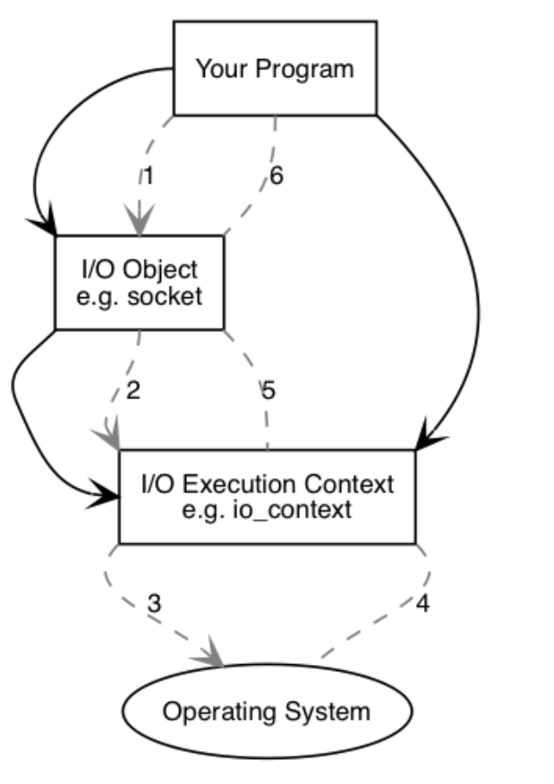
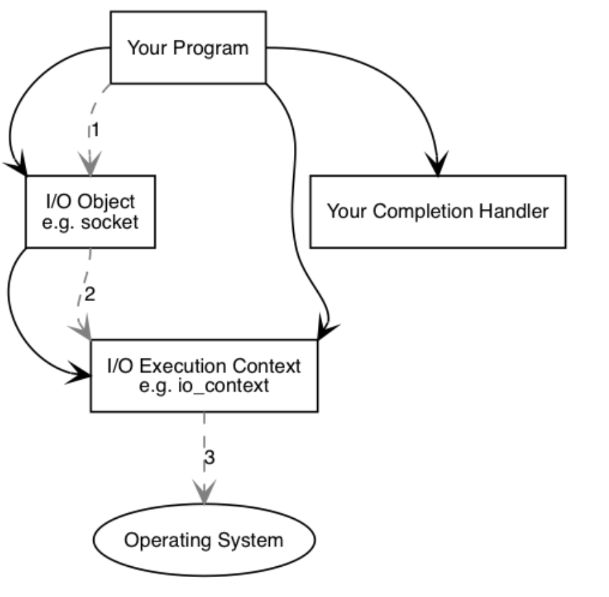
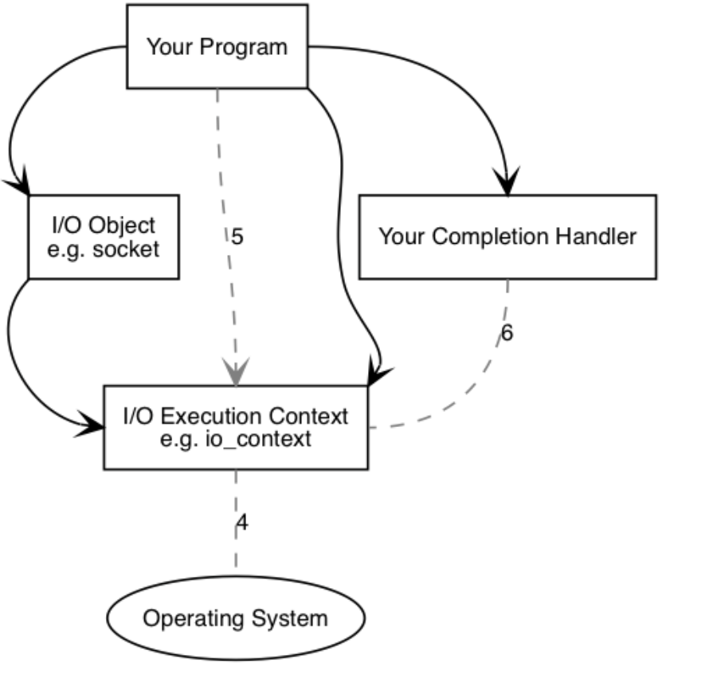
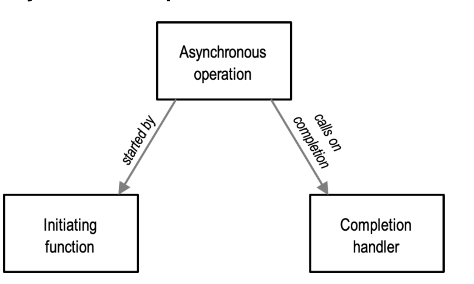
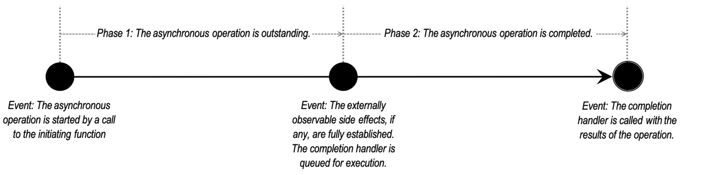
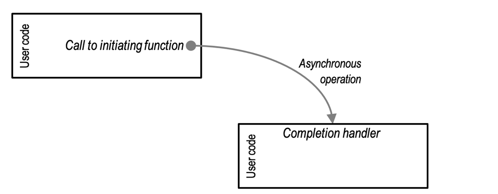
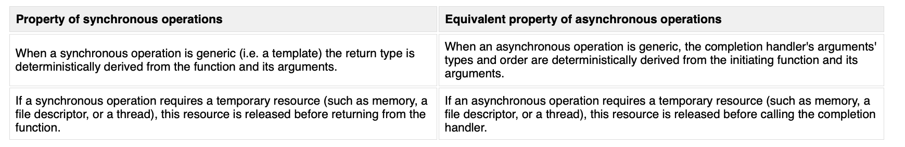
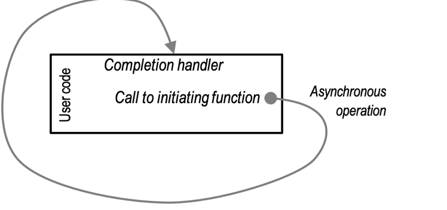
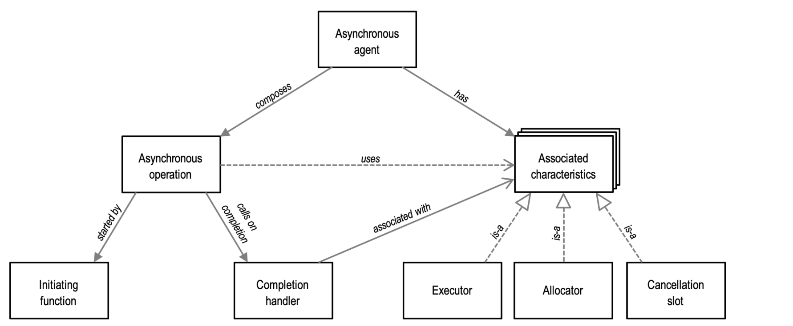
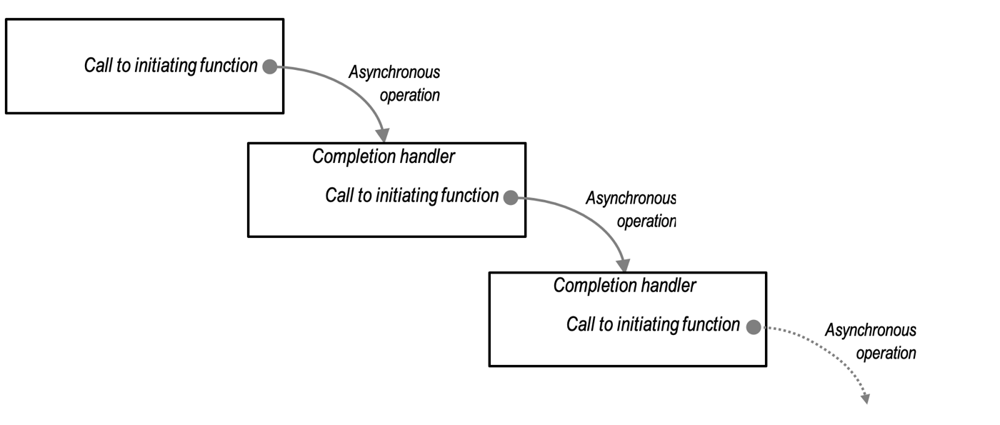

<!--
 * @Author: yao.xie 1595341200@qq.com
 * @Date: 2023-08-04 11:00:41
 * @LastEditors: yao.xie 1595341200@qq.com
 * @LastEditTime: 2023-08-04 16:02:19
 * @FilePath: /boost学习/asio/README.md
 * @Description: 这是默认设置,请设置`customMade`, 打开koroFileHeader查看配置 进行设置: https://github.com/OBKoro1/koro1FileHeader/wiki/%E9%85%8D%E7%BD%AE
-->
# 1. ASIO
## 1.1. 概述
Boost.Asio是一个用于网络和低级I/O编程的跨平台C++库，使用现代C++方法为开发人员提供一致的异步模型。

您的程序将至少有一个I/O执行上下文，例如boost::asio::io_context对象、boost::asio::thread_pool对象或boost::asio::system_context。此I/O执行上下文表示您的程序与操作系统I/O服务的链接。
```
boost::asio::io_context io_context;
```
要执行I/O操作，您的程序将需要一个I/O对象，如TCP套接字：
```
boost::asio::ip::tcp::socket socket(io_context);
```
当执行同步连接操作时，会发生以下一系列事件：
1. 您的程序通过调用I/O对象来启动连接操作：
```
socket.connect(server_endpoint);
```
2. I/O对象将请求转发到I/O执行上下文。

3. I/O执行上下文调用操作系统来执行连接操作。

4. 操作系统将操作结果返回到I/O执行上下文。

5. I/O执行上下文将操作导致的任何错误转换为boost::system::error_code类型的对象。Error_code可以与特定值进行比较，或作为布尔值进行测试（其中错误结果意味着没有发生错误）。然后将结果转发回I/O对象。

6. 如果操作失败，I/O对象会抛出boost::system::system_error类型的异常。如果启动操作的代码被写成：
```
boost::system::error_code ec;
socket.connect(server_endpoint, ec);
```
然后，error_code变量ec将设置为操作结果，并且不会抛出异常。
当使用异步操作时，会发生不同的事件序列。

当执行异步连接操作时，会发生以下一系列事件：


1. 您的程序通过调用I/O对象来启动连接操作：
```
Socket.async_connect（server_endpoint，your_completion_handler）；
```

其中your_completion_handler是具有签名的函数或函数对象：
```
void your_completion_handler(const boost::system::error_code& ec);
```
所需的确切签名取决于正在执行的异步操作。参考文档指出了每个操作的适当形式。

2. I/O对象将请求转发到I/O执行上下文。

3. I/O执行上下文向操作系统发出信号，它应该启动异步连接。
时间流逝。（在同步情况下，这种等待将完全包含在连接操作的持续时间内。）


4. 操作系统表示连接操作已通过将结果放在队列中完成，准备被I/O执行上下文接收。

5. 当使用io_context作为I/O执行上下文时，您的程序必须调用io_context::run()（或类似的io_context成员函数之一）才能检索结果。当有未完成的异步操作时，对io_context::run()块的调用，因此您通常会在开始第一个异步操作后立即调用它。

6. 在对io_context::run()的调用中，I/O执行上下文将操作结果解库，将其转换为error_code，然后将其传递给您的完成处理程序。

这是Boost.Asio如何运作的简化图片。如果您的需求更高级，您将需要进一步研究文档，例如扩展Boost.Asio以执行其他类型的异步操作。

## 1.2. 异步模型
本节介绍了Boost.Asio库核心的异步模型的高级概述。该模型将异步操作作为异步组合的基本构建块，但以一种将它们与组合机制解耦的方式。Boost.Asio中的异步操作支持回调、期货（渴望和懒惰）、光纤、协程和尚未想象的方法。这允许应用程序程序员根据适当的权衡来选择方法。
1. 异步操作

异步操作是Boost.Asio异步模型中的基本组成单位。异步操作表示在后台启动和执行的工作，而启动工作的用户代码可以继续进行其他操作。
从概念上讲，异步操作的生命周期可以用以下事件和阶段来描述：

发起函数是用户可以调用它来启动异步操作的函数。

完成处理程序是用户提供的仅移动函数对象，最多一次与异步操作的结果一起被调用。完成处理程序的调用告诉用户已经发生的事情：操作完成，操作的副作用已经建立。

启动函数和完成处理程序按以下方式整合到用户的代码中：

同步运算被体现为单个函数，因此具有几个固有的语义属性。异步操作采用同步对应方的一些语义属性，以促进灵活和高效的组合。

后者是异步操作的一个重要属性，因为它允许完成处理程序在没有重叠资源使用的情况下启动进一步的异步操作。考虑同一操作在链条中反复重复的琐碎（且相对常见）情况：

通过确保在完成处理程序运行之前释放资源，我们避免了操作链的峰值资源使用量翻倍。
2. 异步代理

异步代理是异步操作的顺序组合。每个异步操作都被视为作为异步代理的一部分运行，即使该代理仅包含该单个操作。异步代理是一个可以与其他代理同时执行工作的实体。异步代理用于异步操作，就像线程用于同步操作一样。

然而，异步代理是一种纯粹的概念结构，它允许我们对程序中异步操作的上下文和组成进行推理。“异步代理”的名称没有出现在库中，使用哪种具体机制[1]在代理中组成异步操作也不重要。

我们可以将异步代理可视化如下：

异步代理交替等待异步操作完成，然后为该操作运行完成处理程序。在代理的上下文中，这些完成处理程序代表了不可分割的可安排工作单位。
## 1.3. Executors执行器
每个异步代理都有一个关联的执行器。代理的执行者决定代理的完成处理程序如何排队并最终运行。

执行器的示例使用包括：

* 协调一组在共享数据结构上运行的异步代理，确保代理的完成处理程序永远不会同时运行[5]。

* 确保代理在靠近数据或事件源（例如NIC）的指定执行资源（例如CPU）上运行。

* 表示一组相关代理，从而使动态线程池能够做出更智能的调度决策（例如将代理作为单元在执行资源之间移动）。

* 排队所有完成处理程序在GUI应用程序线程上运行，以便他们可以安全地更新用户界面元素。

* 返回异步操作的默认执行器原样，以尽可能接近触发操作完成的事件运行完成处理程序。

* 调整异步操作的默认执行器，在每个完成处理程序之前和之后运行代码，例如日志记录、用户授权或异常处理。

* 指定异步代理及其完成处理程序的优先级。

* 异步代理中的异步操作使用代理的关联执行器来：

* 跟踪异步操作所代表的工作的存在，而操作是未完成的。

* 排队完成处理程序，以便操作完成后执行。

* 确保完成处理程序不会重新进入，如果这样做可能会导致无意的递归和堆栈溢出。

因此，异步代理的关联执行器代表了代理应该如何、在哪里和何时运行的策略，被指定为构成代理的代码的交叉关注点。
## 1.4. Allocators分配器
每个异步代理都有一个关联的分配器。代理的分配器是代理的异步操作用于获取每次操作稳定内存资源（POSM）的接口。这个名字反映了一个事实，即内存是每次操作的，因为内存仅在该操作的生命周期内保留，并且是稳定的，因为在整个操作过程中，内存保证在该位置可用。

异步操作可能会以多种不同的方式利用POSM：

* 该操作不需要任何POSM。例如，该操作包装一个执行自己内存管理的现有API，或者像循环缓冲区一样将长期状态复制到现有内存中。

* 只要操作出色，该操作就会使用单个固定大小的POSM。例如，操作将一些状态存储在链接列表中。

* 该操作使用单个运行时大小的POSM。例如，该操作存储用户提供的缓冲区的副本，或运行时大小的iovec结构数组。

* 该操作同时使用多个POSM。例如，链接列表的固定大小的POSM加上缓冲区的运行时大小的POSM。

* 该操作连续使用多个POSM，其大小可能有所不同。

相关分配器允许用户将POSM优化视为异步操作构成的交叉问题。此外，使用分配器作为获取POSM的接口，为异步操作的实现者和用户提供了极大的灵活性：

* 用户可以忽略分配器，并接受应用程序使用的任何默认策略。

* 实现者可以忽略分配器，特别是当操作不被视为对性能敏感时。

* 用户可以为相关的异步操作共同定位POSM，以获得更好的参考位置。

* 对于涉及不同大小的串行POSM的组合，内存使用量只需要与目前现有的POSM一样大。例如，考虑一个包含使用大型POSM（连接建立和握手）的短命操作的组合，然后是使用小型POSM（在对等体和从对等体传输数据）的长寿命操作。

如前所述，所有资源必须在调用完成处理程序之前释放。这使得内存可以回收，以便在代理内进行后续异步操作。这允许具有长寿命异步代理的应用程序没有热路径内存分配，即使用户代码不知道相关的分配器。
## 1.5. Cancellation
在Boost.Asio中，许多对象，如套接字和计时器，通过其关闭或取消成员函数支持在对象范围内取消未完成的异步操作。然而，某些异步操作也支持个人、有针对性的取消。通过指定每个异步代理都有一个关联的取消插槽来启用每次操作的取消。

为了支持取消，异步操作将取消处理程序安装到代理的插槽中。取消处理程序是一个函数对象，当用户向插槽发出取消信号时，将调用该对象。由于取消插槽与单个代理相关联，该插槽一次最多保留一个处理程序，安装新的处理程序将覆盖任何以前安装的处理程序。因此，同一插槽被重新用于代理内部的后续异步操作。

当异步操作包含多个子代理时，取消特别有用。例如，一个子代理可能是完整的，另一个是取消的，因为不再需要其副作用。
## 1.6. 使用，构建和配置
1. 支持的平台
* 定期测试以下平台和编译器组合：
```
        使用g++ 4.6或更高版本的Linux

        使用clang 3.4或更高版本的Linux

        使用g++ 9或更高版本的FreeBSD

        使用Xcode 10或更高版本的macOS

        使用Visual C++ 11.0（Visual Studio 2012）或更高版本的Win32

        使用Visual C++ 11.0（Visual Studio 2012）或更高版本的Win64
```
* 以下平台也可以工作：
```
        AIX
        Android
        HP-UX
        iOS
        NetBSD
        OpenBSD
        QNX Neutrino
        Solaris
        Tru64
        Win32 using MinGW.
        Win32 using Cygwin. (__USE_W32_SOCKETS must be defined.)
```
2. 依赖
* 以下库必须可用才能链接使用Boost.Asio的程序：
```
1. Boost.System for the boost::system::error_code and boost::system::system_error classes.
2. Boost.Coroutine (optional) if you use spawn() to launch coroutines.
3. Boost.Regex (optional) if you use any of the read_until() or async_read_until() overloads that take a boost::regex parameter.
4. OpenSSL (optional) if you use Boost.Asio's SSL support.
```
* 此外，一些示例还需要Boost.Thread、Boost.Date_Time或Boost.Serialization库。
* 使用MSVC或Borland C++，您可能希望将-DBOOST_DATE_TIME_NO_LIB和-DBOOST_REGEX_NO_LIB添加到您的项目设置中，以分别禁用Boost.Date_Time和Boost.Regex库的自动链接。或者，您可以选择构建这些库并链接到它们。
### 1.6.1. 构建
```
b2 --with-system --with-thread --with-date_time --with-regex --with-serialization stage
```
### 1.6.2. 可选的单独编译
默认情况下，Boost.Asio是一个仅限标头的库。然而，一些开发人员可能更喜欢使用单独编译的源代码来构建Boost.Asio。为此，请将#include <boost/asio/impl/src.hpp>添加到程序中的一个（也只有一个）源文件中，然后使用项目/编译器设置中定义的BOOST_ASIO_SEPARATE_COMPILATION构建程序。或者，可以将BOOST_ASIO_DYN_LINK定义为构建单独编译的Boost.Asio作为共享库的一部分。

如果使用Boost.Asio的SSL支持，您还需要添加#include <boost/asio/ssl/impl/src.hpp>。
### 1.6.3. Debug 支持
一些与Asio一起使用的调试器扩展可以在https://github.com/chriskohlhoff/asio-debugger-extensions上找到。
### 1.6.4. 宏
```
https://www.boost.org/doc/libs/1_82_0/doc/html/boost_asio/using.html
```
## 1.7. 教程
### 1.7.1. 计时器
#### 1.7.1.1. Timer.1 - Using a timer synchronously 同步time
[Timer.1 ](src/1.cpp)
#### 1.7.1.2. Timer.2 - Using a timer asynchronously 异步
[Timer.2](src/2.cpp)
#### 1.7.1.3. Timer.3 - Binding arguments to a completion handler（参数绑定）
[Timer.3 ](src/3.cpp)
#### 1.7.1.4. Timer.4 - Using a member function as a completion handler(使用成员函数)
[Timer.4](src/4.cpp)
#### 1.7.1.5. Timer.5 - Synchronising completion handlers in multithreaded programs（同步）
[Timer.5](src/5.cpp)
### 1.7.2. 套接字简介
本节中的教程程序展示了如何使用asio开发简单的客户端和服务器程序。这些教程程序基于日间协议，该协议同时支持TCP和UDP。
#### TCP
##### Daytime.1 - A synchronous TCP daytime client
[Daytime.1](src/6.cpp)
##### Daytime.2 - A synchronous TCP daytime server
[Daytime.2](src/7.cpp)
##### Daytime.3 - An asynchronous TCP daytime server
[Daytime.3](src/8.cpp)
#### UDP
##### Daytime.4 - A synchronous UDP daytime client
[Daytime.4 ](src/9.cpp)
##### Daytime.5 - A synchronous UDP daytime server
[Daytime.5 ](src/10.cpp)
##### Daytime.6 - An asynchronous UDP daytime server
[Daytime.6](src/11.cpp)
##### 异步TCP UDP服务
[异步TCP UDP服务](src/12.cpp)
## 例子
### C++14
#### deferred

### C++17
